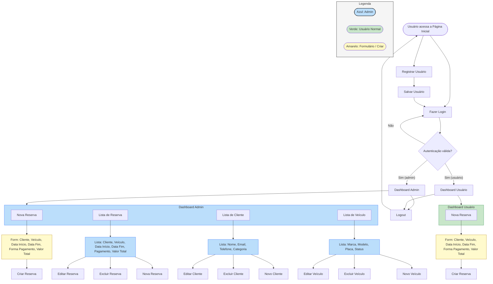

# Luxury_Wheels
Criando site de aluguel de carros

# LuxuryWheels

Aplicação web desenvolvida com Django para gerenciamento de aluguel de veículos. O sistema permite cadastro de usuários, autenticação, listagem e filtragem de veículos, criação de reservas, cálculo automático de valores e controle de disponibilidade.

## Objetivo do Projeto

Fornecer uma plataforma funcional que simula um sistema real de aluguel de automóveis, abrangendo o fluxo completo: o usuário acessa, pesquisa veículos, verifica disponibilidade, realiza a reserva e visualiza o valor calculado.

## Tecnologias Utilizadas

- Python 3.9+
- Django
- PostgreSQL
- HTML, CSS e templates do Django
- Ambiente virtual (venv)

## Estrutura do Projeto

```
Luxury_Wheels/
│
├── manage.py
├── luxurywares/
│   ├── settings.py
│   ├── urls.py
│   ├── models.py
│   ├── views.py
│   ├── admin.py
│   ├── forms.py
│   ├── templates/
│   │   ├── cadastro.html
│   │   ├── login.html
│   │   ├── home.html
│   │   ├── lista_veiculos.html
│   │   ├── detalhes_veiculo.html
│   │   ├── reserva.html
│   │   └── reservas_usuario.html
│   └── migrations/
│
└── venv/
```

## Principais Módulos

**models.py**  
Define entidades como `Cliente`, `Veiculo`, `Categoria`, `Reserva` e `FormaPagamento`, incluindo lógica de valores, disponibilidade e relacionamentos.

**views.py**  
Contém funcionalidades como cadastro, autenticação, listagem de veículos, filtros, criação de reservas, cálculos e exibição das reservas do usuário.

**templates/**  
Inclui todas as páginas de interface do usuário, organizadas por fluxo.

## Funcionalidades

### Usuários
- Cadastro
- Login e logout
- Visualização das próprias reservas

### Veículos
- Listagem geral
- Filtros por categoria, preço e disponibilidade
- Página de detalhes

### Reservas
- Seleção de veículo
- Escolha de datas
- Cálculo automático do valor total
- Verificação de disponibilidade
- Registro da reserva

## Banco de Dados

O projeto utiliza PostgreSQL, com modelos estruturados via ORM do Django.

## Como Executar o Projeto

### 1. Clonar o repositório
```
git clone https://github.com/leticiakaren2015/Luxury_Wheels.git
cd Luxury_Wheels
```

### 2. Criar ambiente virtual
```
python3 -m venv venv
source venv/bin/activate
```

### 3. Instalar dependências
```
pip install -r requirements.txt
```

### 4. Ajustar configurações
Edite `settings.py` para definir:
- Banco de dados PostgreSQL
- SECRET_KEY
- DEBUG conforme necessário

### 5. Aplicar migrações
```
python manage.py migrate
```

### 6. Executar servidor
```
python manage.py runserver
```

Acesse:
```
http://localhost:8000/
```

## Estrutura de Modelos (Resumo)

### Cliente
Dados vinculados ao usuário do sistema.

### Categoria
Classificação do veículo (sedan, SUV, esportivo etc.).

### Veículo
Modelo, marca, categoria, preço por dia e disponibilidade.

### Reserva
Associação entre cliente, veículo, datas e preço total calculado.

## Status do Projeto

Projeto funcional com fluxo completo de reservas. Aberto para melhorias e expansões futuras.



